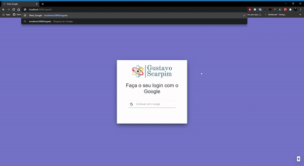

# Autenticação com o Google e bloqueio de rotas (SSR) utilizando Next.JS, React.Js e Styled-Components.
 
Esse projeto tem como objetivo demonstrar uma maneira simples para bloqueio de rotas utilizando o NextJs junto com o ReactJs que é muito utilizado para SEO com SSR.

## Iniciar Projeto

<b>1º Clone esse repositório no seu computador ou baixe no formato (ZIP).</b>

<b>2º Abra o projeto em seu editor favorito e rode o seguinte comando na raiz do projeto 'npm install ou yarn install' para poder baixar todas as depêndencias do projeto.</b>

<b>3º Verifique o seu package.json e insira ("scripts": {"dev": "next",
                                                        "build": "next build",
                                                        "start": "next start" }) para poder fazer a inicialização do projeto.</b>

<b>4º Rode o seguinte comando "npm run dev ou Yarn dev" para inicializar o projeto.</b>

# Desenvolvido por Gustavo Scarpim:

